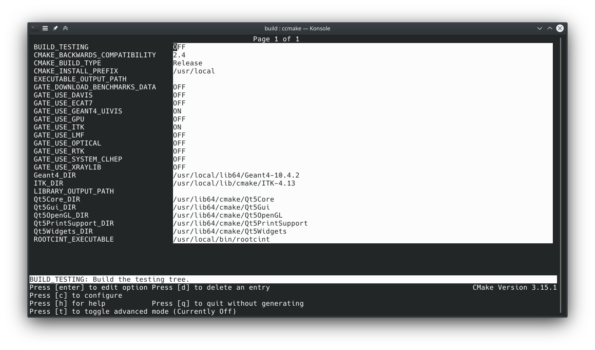

# GATE-Installation-Guide

# 運行環境： ` openSUSE Tumbleweed `

# Step 1: Preparation：

  1. Compilation environment:

  - ` gcc ` 4.8 to 7.3
  - ` cmake ` 3.3 to last version
  - ` root ` 6.00 to last version

  2. Source code download:

  - <del>[CLHEP](http://proj-clhep.web.cern.ch/proj-clhep/DISTRIBUTION/tarFiles/clhep-2.3.4.3.tgz)</del>（CLHEP is already included in geant4）
  - [geant4](http://geant4-data.web.cern.ch/geant4-data/releases/geant4.10.05.p01.tar.gz)
  - [gate](http://www.opengatecollaboration.org/sites/default/files/Gate-8.2.tar.gz)
  - <del>[lmf](http://www.opengatecollaboration.org/sites/default/files/lmf_v3_0.tar_2.gz)</del> (No more Optional Required)


# <del>Step 2: Installation of [CLHEP](http://proj-clhep.web.cern.ch/proj-clhep/clhep23.html)：A Class library for High Energy Physics</del>

  1. Download the source：[clhep-2.3.4.3.tgz](http://proj-clhep.web.cern.ch/proj-clhep/DISTRIBUTION/tarFiles/clhep-2.3.4.3.tgz);
  2. Run the following commands:

```
 tar -zxvf clhep-2.3.4.3.tgz
 mkdir clhep_build
 cd clhep_build
 ccmake -DCMAKE_INSTALL_PREFIX=/usr/local/CLHEP/ ../2.3.4.3/CLHEP/
 make -j2
 sudo make install
```


# Step 3: Installation of geant4 10.05

  1. Download the source：[geant4 10.05](http://geant4-data.web.cern.ch/geant4-data/releases/geant4.10.05.p01.tar.gz)
  2. Dependencies： 

 - <del>` gdml `</del>
 - ` xerces-c `
 - ` libxerces-c-devel `
 - ` libqt4-devel ` ` libqt4-devel-doc `
 - ` libG4OpenGL ` ` libQt5OpenGL-devel `
 - ` libQt5PrintSupport-devel `
 - ` libXmu-devel `
 - <del>` gccxml `</del>

  3. install:

``` bash
    tar -xzf geant4.10.05.p01.tar.gz
    cd /home/geant4.10.05/
    mkdir build
    cd build
    ccmake ../
    # Build Options
    make -j4
    sudo make install
```

## Build Options of Geant4


Configuration Instructions:

  1. Do not select GEANT4_BUILD_MULTITHREADED as Gate does not support multi-threaded Geant4.
  2. GEANT4_INSTALL_DATADIR specifies the location of data files and can be a relative position to CMAKE_INSTALL_DATA.
  3. GEANT4_INSTALL_DATA set to ON will automatically download data from the internet.
  4. GEANT4_USE_SYSTEM_CLHEP set to ON will use an external CLHEP library. It will automatically be set to ON if the CLHEP_ROOT_DIR variable has a value.


### Geant4 related plugins:：

```
http://geant4.cern.ch/support/source/G4NDL.4.5.tar.gz
http://geant4.cern.ch/support/source/G4EMLOW.7.7.tar.gz
http://geant4.cern.ch/support/source/G4PhotonEvaporation.5.3.tar.gz
http://geant4.cern.ch/support/source/G4RadioactiveDecay.5.3.tar.gz
http://geant4.cern.ch/support/source/G4NEUTRONXS.1.4.tar.gz
http://geant4.cern.ch/support/source/G4PII.1.3.tar.gz
http://geant4.cern.ch/support/source/G4RealSurface.2.1.1.tar.gz
http://geant4.cern.ch/support/source/G4SAIDDATA.2.0.tar.gz
http://geant4.cern.ch/support/source/G4ABLA.3.1.tar.gz
http://geant4.cern.ch/support/source/G4ENSDFSTATE.2.2.tar.gz
sudo mkdir /usr/local/share/Geant4-10.5.1/
sudo mkdir /usr/local/share/Geant4-10.5.1/data/
for tar in *.tar.gz; do sudo tar xvf $tar -C /usr/local/share/Geant4-10.5.1/data/; done
```

## Geant4 [graphics engine](http://geant4.cern.ch/UserDocumentation/UsersGuides/ForApplicationDeveloper)：

Geant4 comes with several default graphics engines:DAWNFILE, HepRepFile, HepRepXML, RayTracer, VRML1FILE, VRML2FILE and ATree and GAGTree.

http://blog.renren.com/blog/bp/Q7K9U584qP mentions four ways to run the OpenGL engine: `openGLX, openGLSX, openGLXm, openGLSXm`


## Installation of examples：

     cd /usr/local/share/Geant4-10.5.1/examples/
     sudo mkdir build
     sudo ccmake ../
     sudo make -j4

Run these examples in the `build` folder. For example, execute:

```
 ./exampleB1
```
In all examples, there are three examples under `~/geant4.10.03/examples/extended/persistency/` that fail to compile, and the issue cannot be resolved at the moment. Please comment out the `persistency` section in `~/geant4.10.03/examples/extended/CMakeLists.txt`.

``` 
 # add_subdirectory(persistency)
```

If the following error message appears when running the example
```
 libGL error: failed to load driver: swrast
```
This is caused by the graphics driver. You need to install `Mesa-32bit`. If the error still persists after installation, run:
```
 sudo mkdir /usr/lib64/dri/updates/
 ln -s /usr/lib64/dri/swrast_dri.so /usr/lib64/dri/updates/swrast_dri.so
```


# <del>Step 4: Installation of lmf</del>

 - Modify  ./lmf_v3.0/makefile:

```
PATHLMFCOMMON = /opt/lmf
install : 
	-mkdir $(PATHLMFCOMMON)
	-chmod -R 700 $(PATHLMFCOMMON)
	-mkdir $(PATHLMFCOMMON)/lib
	-mkdir $(PATHLMFCOMMON)/includes
	-rm -rf $(PATHLMFCOMMON)/$(LIB)
	-rm -rf $(PATHLMFCOMMON)/includes/*	
	-cp $(LIB) $(PATHLMFCOMMON)/$(LIB)
	-cp includes/* $(PATHLMFCOMMON)/includes/
	-chmod -R 555 $(PATHLMFCOMMON)
```

 - Modify  ./lmf_v3.0/examples/makefile:

```
EXE_04 : exempleMain_04.o
	gcc -o $@ $^ $(LDFLAGS) -lstdc++
	@echo "example 4 : EXE_04 ok..."
```

```
tar -xzf lmf_v3_0.tar.gz
cd ./lmf_v3.0/
./configure
make -j2
sudo make install
cd ./example
make
```

# Step 5: Installation of ITK && RTK && root6

```
sudo zypper in valgrind
tar -xzf InsightToolkit-4.13.0.tar.gz 
cd InsightToolkit-4.13.0 
mkdir build && cd build
ccmake ../
#  Notice the version of GCC.
make -j4
sudo make install
cd ../..
```


```
sudo zypper in gengetopt
unzip RTK-1.4.0.zip
cd RTK-1.4.0
mkdir build && cd build
ccmake ../
make -j4
sudo make install
```


```
wget https://root.cern.ch/download/root_v6.14.04.source.tar.gz
tar -xzf root_v6.14.04.source.tar.gz
cd ./root/build
ccmake ../
make -j4
sudo make install

```


# Step 6: Installation of GATE 8.2

  1. Dependencies：
     - ` gcc ` 4.8 to 7.3 (Note: with gcc 6.* and newer, ROOT 5 does not compile!)
     - ` cmake ` 3.3 to last version (with SSL support)
     - ` root ` 6.00 to last version
     - ` geant4 ` 10.05
     - sudo zypper in libqt4-devel libqt4-devel-doc 
     - sudo zypper in libG4OpenGL libQt5OpenGL-devel libQt5PrintSupport-devel gccxml
     - lmf 3.0
     - RTK 1.4 (Optional dependencies)
  2. Install:

``` bash
    tar -xzf Gate-8.2.tar.gz -C /home/qingyu
    cd Gate-8.2/
    mkdir build
    cd build/
    ccmake ../  # press `C` to configure 
    # CMAKE_INSTALL_PREFIX = ` /usr/local/ `
    # press `g ` to gernerate the makefile.
    make -j4
    sudo make install
```




3. Last step, update your environment variables file with the following command lines(bash or zsh): Gate/Root/Geant4

```
    export PATH=$PATH:/usr/local/bin
    source ${ROOTSYS}/bin/thisroot.sh
    export LMF_HOME=/opt/lmf
    export LD_LIBRARY_PATH=/usr/local/lib64
    source /usr/local/bin/geant4.sh
```

NOTE:

 - it is common to encounter errors downloading `data_Voxel_Phantom.root` When using the `make` command to compile GATE, In such cases, it is necessary to try compiling multiple times until the download is successful.
 - If the compilation fails and displays errors indicating that certain files were not downloaded successfully, the solution is to manually download those files and place them in the corresponding directory.

```
Generating /home/qingyu1/gate_v8.0/examples/example_ROOT_Analyse/data_PET.root
Generating /home/qingyu1/gate_v8.0/examples/example_ROOT_Analyse/data_Voxel_Phantom.root
Generating /home/qingyu1/gate_v8.0/examples/example_dosimetry/brachytherapy/data/ct-2mm.raw
Generating /home/qingyu1/gate_v8.0/examples/example_dosimetry/protontherapy/data/patient-2mm.raw

"http://midas3.kitware.com/midas/api/rest?method=midas.bitstream.download&checksum=a44e7bc7c3f2690a9e94e4ef4c5d3f1a&algorithm=MD5"
"http://midas3.kitware.com/midas/api/rest?method=midas.bitstream.download&checksum=9c0989256d3b6e9b213359cd4a3b6daa&algorithm=MD5"
"http://midas3.kitware.com/midas/api/rest?method=midas.bitstream.download&checksum=83d961494d5b44d76fccb1922012897f&algorithm=MD5"
"http://midas3.kitware.com/midas/api/rest?method=midas.bitstream.download&checksum=baf4a6c7958099ca39965928f010e7c6&algorithm=MD5"
```


# Step 7 Configuration of `.bashrc` or `.zshrc`

```
# Geant4 10.4.2 & Gate_v8.1
export PATH=$PATH:/usr/local/bin
#export LMF_HOME=/opt/lmf
export LD_LIBRARY_PATH=/usr/local/lib
#source /usr/local/bin/geant4.sh
#-----------------------------------------------------------------------
# Resource file paths
# - Datasets
export G4ENSDFSTATEDATA=/usr/local/share/Geant4-10.4.2/data/G4ENSDFSTATE2.2
export G4NEUTRONHPDATA=/usr/local/share/Geant4-10.4.2/data/G4NDL4.5 
export G4LEDATA=/usr/local/share/Geant4-10.4.2/data/G4EMLOW7.3
export G4LEVELGAMMADATA=/usr/local/share/Geant4-10.4.2/data/PhotonEvaporation4.3
export G4RADIOACTIVEDATA=/usr/local/share/Geant4-10.4.2/data/RadioactiveDecay5.2
export G4NEUTRONXSDATA=/usr/local/share/Geant4-10.4.2/data/G4NEUTRONXS1.4 
export G4PIIDATA=/usr/local/share/Geant4-10.4.2/data/G4PII1.3 
export G4REALSURFACEDATA=/usr/local/share/Geant4-10.4.2/data/RealSurface2.1.1
export G4SAIDXSDATA=/usr/local/share/Geant4-10.4.2/data/G4SAIDDATA1.1 
export G4ABLADATA=/usr/local/share/Geant4-10.4.2/data/G4ABLA3.1
```


Note that adding `source /usr/local/bin/geant4.sh` to the `.bashrc` file in the GreanWall computer's system may cause issues with the KDE Plasma desktop. Specifically, the desktop may appear black, but if TeamViewer is installed, it can still be seen on the desktop. You can use TeamViewer to open Firefox and control other computers, but the desktop environment will not load properly. This is likely because `geant4.sh` is overriding certain path variables, causing the plasma shell to not function correctly. If you don't add `source /usr/local/bin/geant4.sh` to the `.bashrc` file, you may encounter the following error when running Gate:

1.
        ```
                [G4-cerr] 
        -------- EEEE ------- G4Exception-START -------- EEEE -------
        *** G4Exception : PART70000
            issued by : G4NuclideTable
        G4ENSDFSTATEDATA environment variable must be set
        *** Fatal Exception *** core dump ***
        -------- EEEE -------- G4Exception-END --------- EEEE -------

                [G4-cerr] 
                [G4-cerr] *** G4Exception: Aborting execution ***
        Aborted (core dumped)
        ```
2.`libG4Tree.so` not found
Solution: Add the following line to your `.bashrc` or `.zshrc` file:

 > export G4ENSDFSTATEDATA=/usr/local/share/Geant4-10.2.3/data/G4ENSDFSTATE1.2.3
 > #The new version of Geant4 does not require adding additional variable information!!!
 > #When the Linux desktop crashes and cannot be accessed, consider whether it is caused by the user configuration file. You can log in as a new user to see if you can enter the desktop normally!!!
